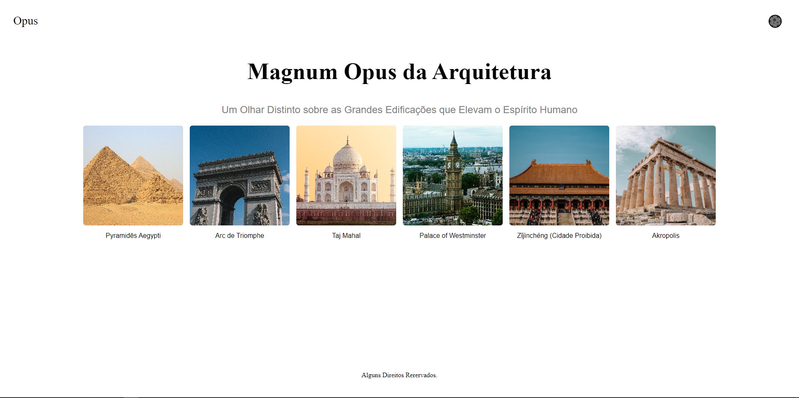
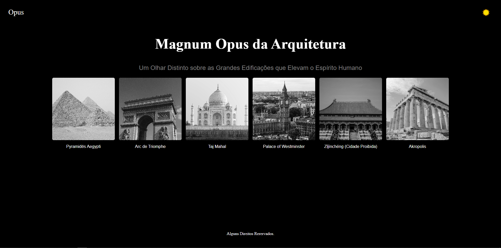
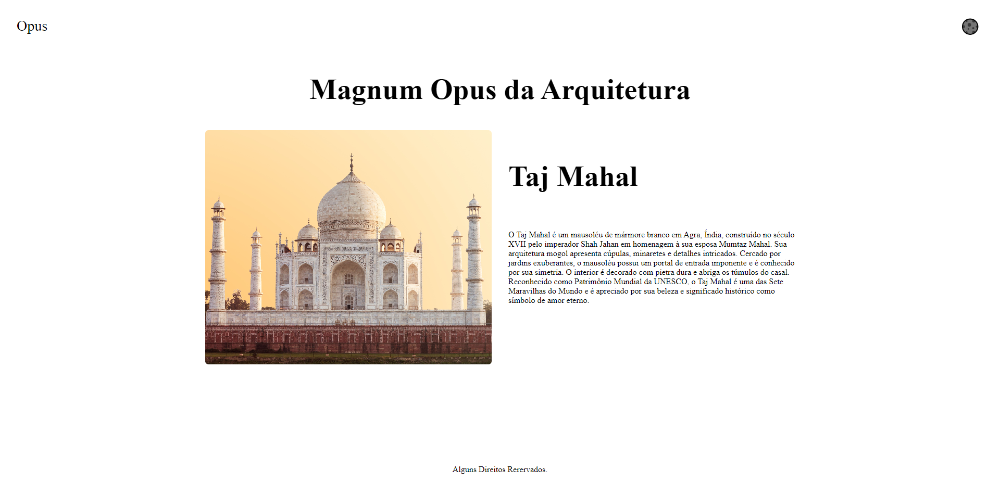
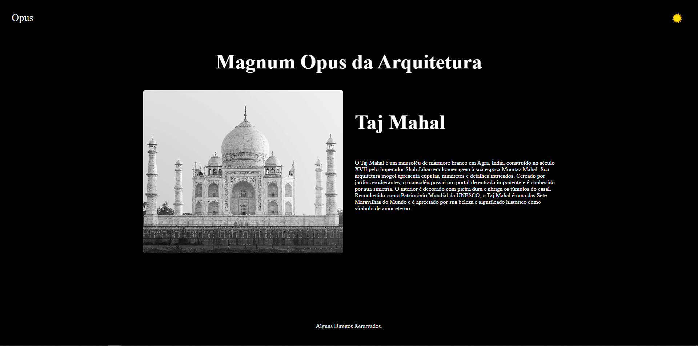

# Opus

Este Projeto foi criado utilizando uma fakeAPI para praticar requisições http.

## Funcionalidades

- Busca de dados de API
- mudança de pagina sem reload
- Pagina unica para cada item
- Troca de temas Light e Dark
- Sitema que salva as preferências de tema do usuario

## Stack utilizada

**Front-end:** React, React-Router-DOM, FetchAPI, Styled-Components

## Screenshots







## Rodando localmente

Clone o projeto

```bash
  git clone https://github.com/renan-nixdorf/Opus.git
```

Entre no diretório do projeto

```bash
  cd Opus
```

Instale as dependências

```bash
  npm install
```

Inicie o servidor

```bash
  npm run dev
```

## Aprendizados

Criar uma API falsa foi muito interessante porque aprendi algumas coisas sobre como os dados são retornados ao front end e como sua arquitetura interfere no desenvolvimento da aplicação.

## Feedback

Se você tiver algum feedback, por favor me envie. :)

## Autor

- [@renan-nixdorf](https://github.com/renan-nixdorf)
